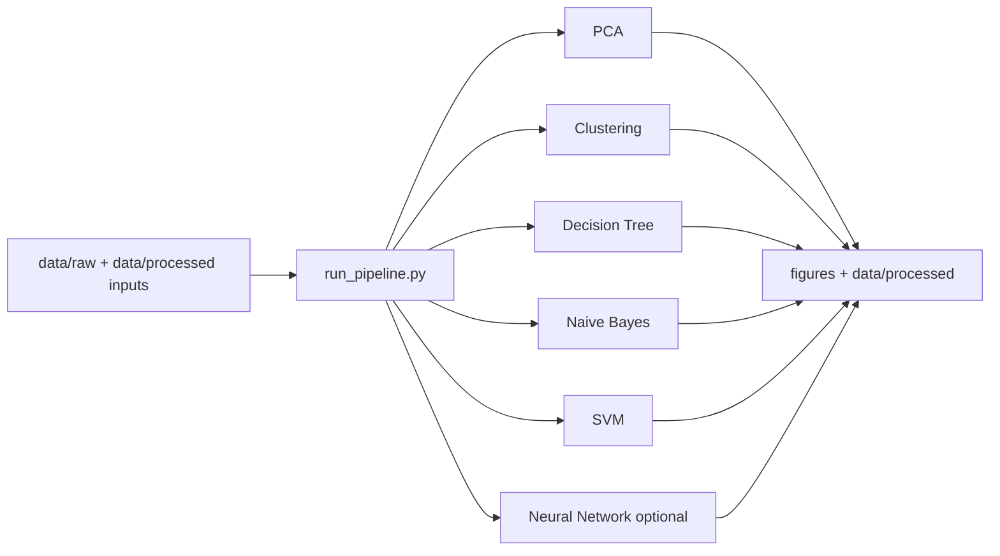

# Predicting the Pathogenicity of Genetic Variants Using Machine Learning

[](https://github.com/anneliset47/ml-pathogenicity.github.io/actions/workflows/reproducibility.yml)
[](LICENSE)

Machine learning analysis and visual reporting for classifying genetic variants as pathogenic vs non-pathogenic.

- Live project site: https://ml-pathogenicity.github.io/
- Primary audience: recruiters, collaborators, and reviewers who need a one-command reproducible run.

## Project Structure

```text
.
├── data/
│   ├── raw/            # source datasets
│   ├── processed/      # cleaned and model output tables
│   └── derived/
├── src/
│   ├── data_ingestion/
│   ├── data_processing/
│   ├── modeling/
│   └── visualization/
├── figures/            # generated plots
├── docs/               # GitHub Pages site content
├── run_pipeline.py     # reproducible pipeline entrypoint
└── Makefile            # setup/reproduce shortcuts
```

## Architecture



## Quickstart

### Option A: Make (fastest)

```bash
git clone https://github.com/anneliset47/ml-pathogenicity.github.io.git
cd ml-pathogenicity.github.io
make setup
make reproduce
```

For contributor/developer quality tooling:

```bash
make setup-dev
make quality
```

### Option B: Manual

```bash
git clone https://github.com/anneliset47/ml-pathogenicity.github.io.git
cd ml-pathogenicity.github.io
python3 -m venv .venv
source .venv/bin/activate
python -m pip install --upgrade pip
pip install -r requirements.txt
python run_pipeline.py --all
```

## What the Pipeline Runs

`python run_pipeline.py --all` runs in deterministic order:

1. PCA
2. Clustering
3. Decision Tree
4. Naive Bayes
5. SVM

Outputs are generated in:

- `figures/`
- `data/processed/`

## Optional Neural Network Step

The neural network is intentionally optional because TensorFlow installation can vary by platform.

```bash
pip install -r requirements-optional.txt
python run_pipeline.py --all --with-nn
```

## Reproducibility Guarantees

- Fixed random seeds are used where applicable (`random_state=42` / NumPy seed).
- Required input files are validated before each step.
- Input datasets are included in this repository.
- CI enforces reproducibility on every push/PR via `.github/workflows/reproducibility.yml`.
- CI also enforces linting (`ruff`), type-checking (`mypy`), and smoke tests (`pytest`).

## Expected Artifacts

Core run (`--all`) should produce/update:

- `figures/pca_projection_sampled.png`
- `figures/silhouette_scores_sampled.png`
- `figures/decision_tree_confusion_matrix.png`
- `figures/naive_bayes_confusion_matrix.png`
- `figures/svm_confusion_matrices.png`
- `data/processed/svm_results.csv`

Optional NN run also produces:

- `figures/nn_confusion_matrix.png`
- `data/processed/nn_train_sample.csv`

## Model Performance Snapshot

Representative local run metrics from the bundled dataset:

| Model | Metric | Value |
|---|---|---|
| Decision Tree | Accuracy | 0.63 |
| Naive Bayes | Accuracy | 0.67 |
| SVM (best tested config) | Accuracy | 0.7333 |

Notes:
- SVM comparison values are persisted to `data/processed/svm_results.csv`.
- Values may vary slightly if data or preprocessing changes.

## Repository Standards

- Contributing guide: `CONTRIBUTING.md`
- Code of conduct: `CODE_OF_CONDUCT.md`
- Security policy: `SECURITY.md`
- Citation metadata: `CITATION.cff`
- Changelog: `CHANGELOG.md`
- Release notes template: `RELEASE_NOTES_TEMPLATE.md`

## Limitations and Future Work

Current limitations:
- Feature engineering remains intentionally simple for reproducibility and readability.
- Metrics are based on the bundled dataset and should not be interpreted as clinical-grade performance.
- Some legacy exploratory scripts are retained for provenance and are not fully standardized.

Planned improvements:
- Add richer feature sets and calibrated probability outputs.
- Expand unit test coverage for modeling helper functions.
- Add automated release publishing with versioned notes.

## Troubleshooting

- Use `python3` if `python` is unavailable.
- Ensure the virtual environment is activated before install/run.
- If TensorFlow fails on your machine, skip `--with-nn` and run the core pipeline.
